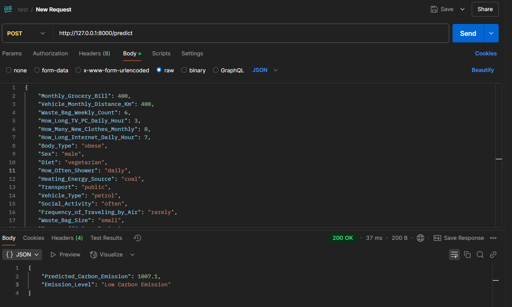

# Carbon Emission Predictor

A machine learning-based web application to predict average CO2 emission of an individual.
<video controls src="2025-03-16 21-38-52.mp4" title="Title"></video>

## Introduction

This project aims to estimate the average carbon footprint of an individual based on their lifestyle and habits. We use a Gradient Boosting Regressor to make predictions and provide a user-friendly interface to collect data and display results.

## Features

* User input form to collect data
* Prediction of average CO2 emission using Gradient Boosting Regressor
* Display of predicted emission level (low, medium, high)

## Requirements

* Python 3.8+
* FastAPI 0.63+
* React 17+
* scikit-learn 0.23+
* pandas 1.2+

## Setup and Installation

1. Clone the repository: `git clone https://github.com/AbhinayBhadauria99/co2-emission-predictor.git`
2. Install dependencies: `pip install -r requirements.txt` and `npm install`
3. Run the FastAPI server: `uvicorn server:app --reload --port 8000`
4. Run the React frontend: `npm start`

## Usage

1. Fill out the user input form
2. Submit the form to get a prediction
3. Interpret the predicted emission level

## API Documentation

### Endpoints

* `POST /predict`: Make a prediction based on user input
	+ Request body: JSON object with user input data
	+ Response: JSON object with predicted emission level

## License

This project is released under the MIT License.
